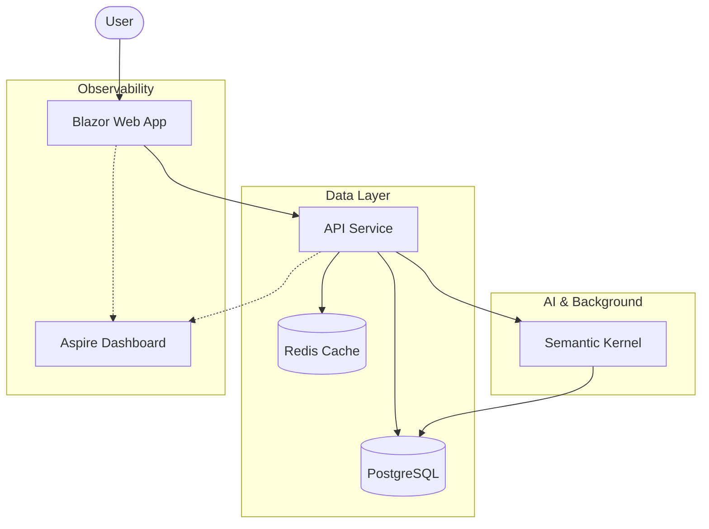

# Workify - Intelligent Enterprise ERP (2026 Edition)

  

**Workify** is a next-generation Business Management Suite designed for the modern enterprise. Built on the cutting-edge **.NET 10** platform and orchestrated with **.NET Aspire**, it unifies CRM, Project Management, Invoicing, and HR into a single, cohesive distributed system.

## 🚀 Key Features

*   **🤖 AI-Powered Insights**: Integrated **Semantic Kernel** agent ("Workify Bot") that can query your database to answer questions about budget, revenue, and client history.
*   **⚡ High-Performance Architecture**:
    *   **Vertical Slice Architecture** for the API, ensuring features are loosely coupled and highly cohesive.
    *   **.NET 10 HybridCache** backed by Redis for lightning-fast data retrieval.
    *   **PostgreSQL** with `jsonb` support for flexible auditing and timeline tracking.
*   **📊 Advanced Invoicing**: Complete billing engine with PDF generation (QuestPDF) and revenue tracking.
*   **☁️ Cloud-Native Ready**: Fully containerized development environment managed by .NET Aspire (Postgres, Redis, API, Web).
*   **📈 Observability**: Built-in OpenTelemetry instrumentation for tracking custom business metrics (`workify.revenue`, `workify.projects.created`) alongside standard system metrics.

## 🛠️ Technology Stack

*   **Orchestration**: .NET Aspire
*   **Backend**: ASP.NET Core 10 (Minimal APIs)
*   **Frontend**: Blazor Web App (Interactive Server/Client)
*   **Database**: PostgreSQL (Entity Framework Core 10)
*   **Caching**: Redis + Microsoft.Extensions.Caching.Hybrid
*   **AI/LLM**: Microsoft Semantic Kernel
*   **PDF Generation**: QuestPDF
*   **Monitoring**: OpenTelemetry + Aspire Dashboard

## 🏗️ Architecture

Workify follows a modular monolith approach where features are vertically sliced, yet the system is distributed via Aspire.



## 🏁 Getting Started

### Prerequisites
*   [.NET 10 SDK](https://dotnet.microsoft.com/download/dotnet/10.0)
*   [Docker Desktop](https://www.docker.com/products/docker-desktop) (for containers)

### Running the App
1.  Clone the repository:
    ```bash
    git clone https://github.com/junaid109/Workfify-App.git
    cd Workfify-App
    ```
2.  Trust the development certificate:
    ```bash
    dotnet dev-certs https --trust
    ```
3.  Run the Aspire AppHost:
    ```bash
    dotnet run --project WorkifyApp.AppHost
    ```
4.  Open the **Aspire Dashboard** URL printed in the console to view all services, logs, and metrics.

## 📂 Project Structure

*   **`WorkifyApp.AppHost`**: The orchestrator project that spins up all other services and containers.
*   **`WorkifyApp.ApiService`**: The core backend logic, structured in vertical slices (`Features/Clients`, `Features/Projects`, etc.).
*   **`WorkifyApp.Web`**: The Blazor frontend application.
*   **`WorkifyApp.ServiceDefaults`**: Shared configuration for OpenTelemetry, Health Checks, and Service Discovery.

## 🤝 Contributing
1.  Fork the repo
2.  Create a feature branch (`git checkout -b feature/amazing-feature`)
3.  Commit your changes (`git commit -m 'feat: Add amazing feature'`)
4.  Push to the branch (`git push origin feature/amazing-feature`)
5.  Open a Pull Request

## 📄 License
This project is licensed under the MIT License.
